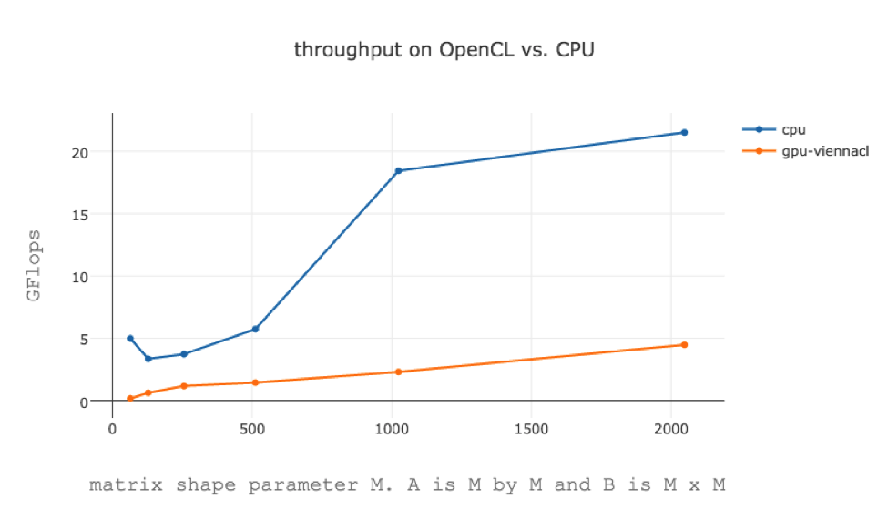
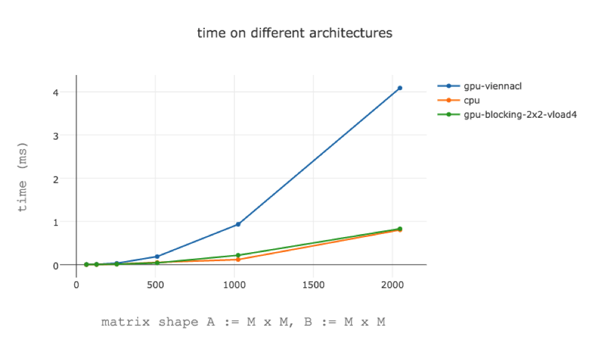
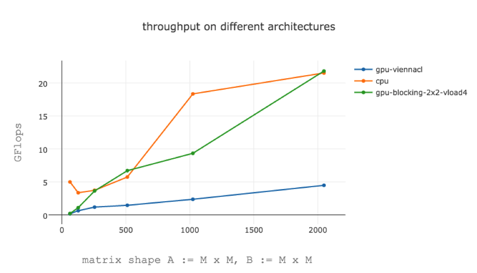
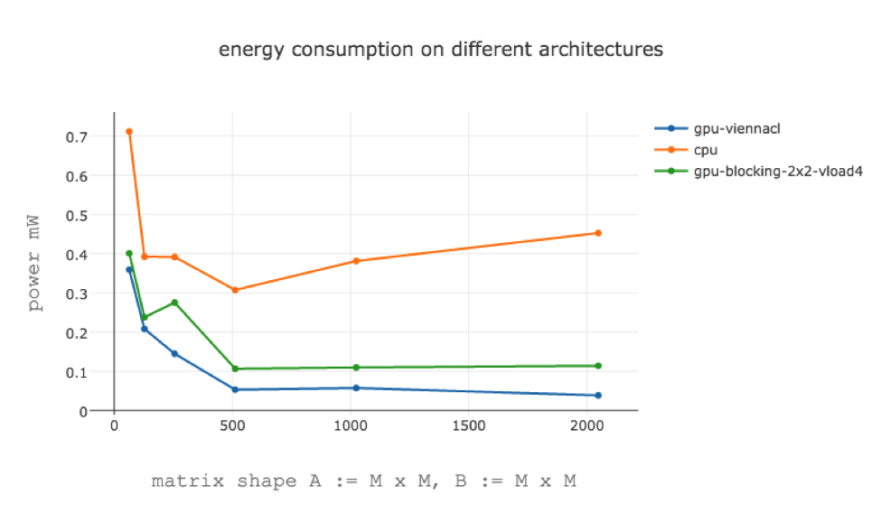
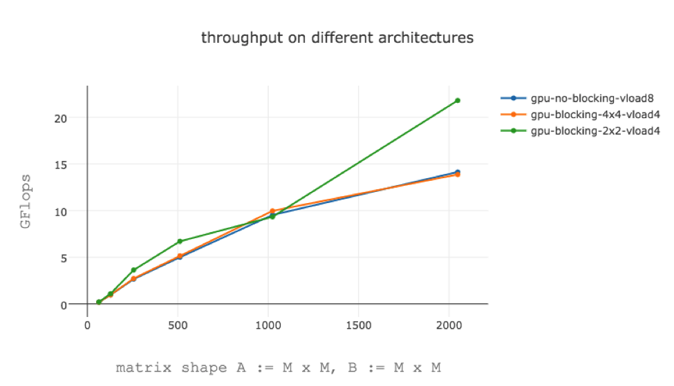
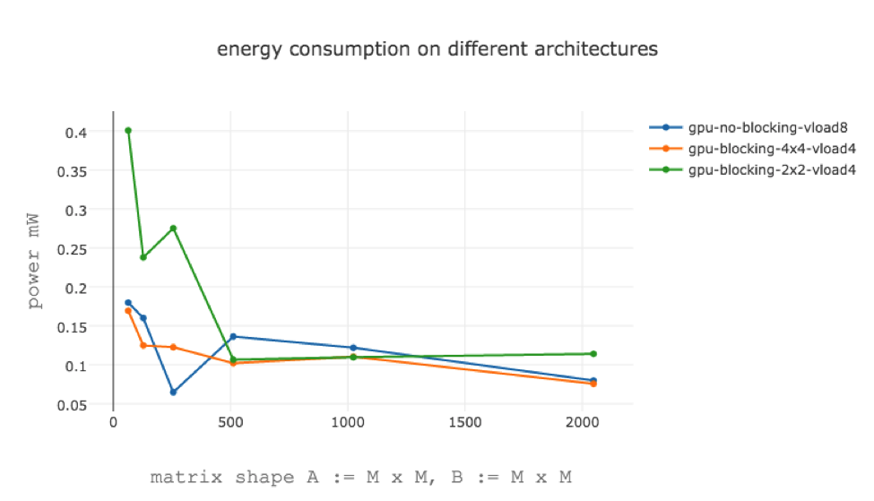
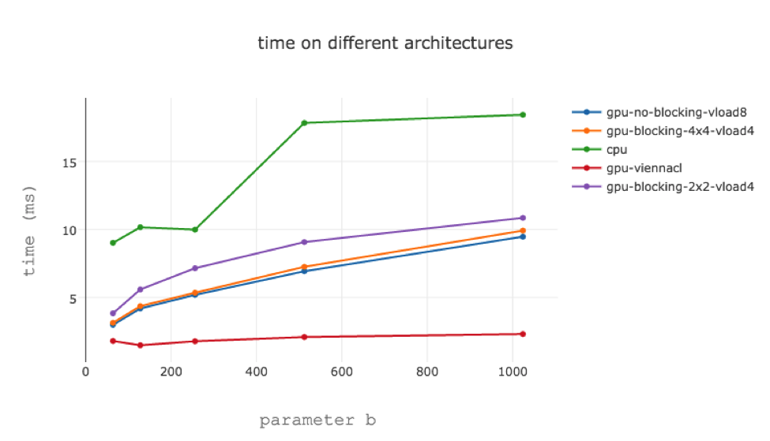
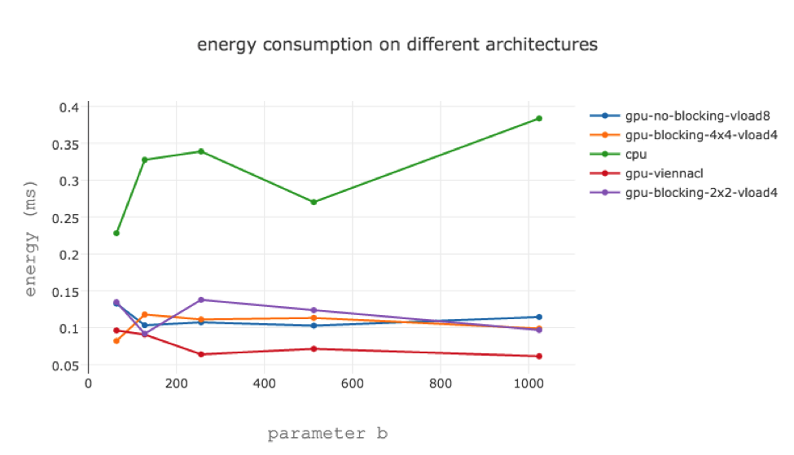
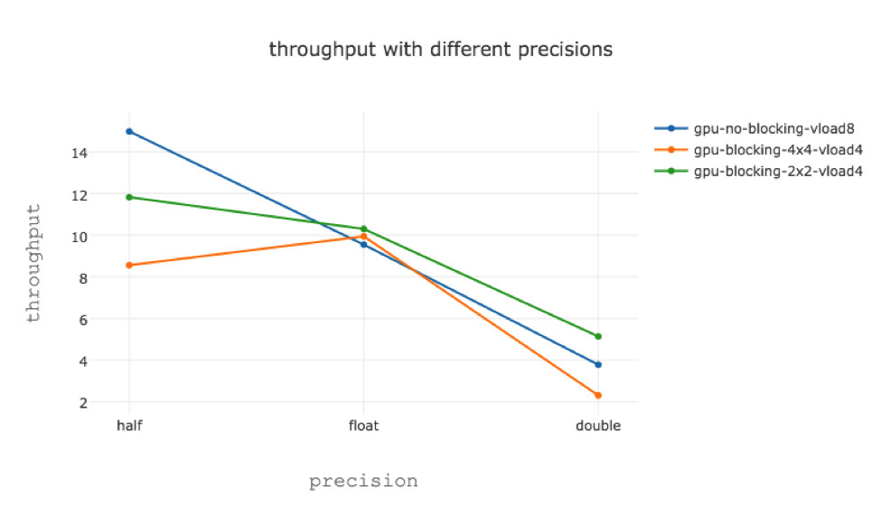

## Profiling GEMM on Android

# The Gap

Caffe relies heavily on GEMM. For example, ~90% of the computation in AlexNet is convolution. And Caffe implements convolution by turning it into GEMM through lowering. Therefore, it is important that GEMM runs fast.

To run GEMM on phone’s GPU, we need to implement it in OpenCL. After searching on the web, I found two popular OpenCL based BLAS implementations:

* [ViennaCL](http://viennacl.sourceforge.net). Supports OpenCL >= 1.1.
* [clBLAS] (clBLAS). Requires OpenCL >= 1.2.


Unfortunately, our Android phone only supports OpenCL 1.1. However, there are [a few benchmark results](http://viennacl.sourceforge.net/viennacl-benchmarks.html) showing ViennaCL with better performance than clBLAS.


<center>**There is a big gap between GPU and CPU performance**</center>


The gap between GPU and its peak performance is even bigger. Using open-source clpeak benchmark tool, we get the following peak data:

```
Platform: ARM Platform
  Device: Mali-T760
    Compute units   : 8
    Clock frequency : 772 MHz
    workgroup sizes : 256

    Single-precision compute (GFLOPS)
      float   : 12.32
      float2  : 32.25
      float4  : 31.79
      float8  : 45.37
      float16 : 154.02

    Double-precision compute (GFLOPS)
      double   : 3.04
      double2  : 30.11
      double4  : 22.09
      double8  : 35.68
      double16 : 34.79
```
Here, float**x** and double**x** are the SIMD instruction used. **x** stands for x numbers at a time.

# Better GEMM Kernels

As pointed out in [this study](http://malideveloper.arm.com/downloads/GPU_Pro_5/GronqvistLokhmotov_white_paper.pdf), the GPU we used (Mali GPU) has the following constraints:


where I is the number of work items in parallel, and R is the number of registers used in kernel. **This implies it would be hard to implement kernels with complex caching and blocking.**


## Implementation #1: just vectorize
```
__kernel void gemm (
    __global const T * restrict A,
    __global const T * restrict B,
    __global T * restrict C,
    int size_a, 
    int size_b, 
    int size_c
)
{
    const int i = get_global_id(0);
    const int j = get_global_id(1);

    T8 sum = (T8)0.0f;
  
    A += i * size_b;
    B += j * size_b;

    for (int l = 0; l < size_b; l += 8)
    {
        T8 x = vload8(0, A);
        T8 y = vload8(0, B);

        sum += x * y;

        A += 8; // this is faster than A[i* k + l]. 11 GFlops vs. 10 GFlops.
        B += 8;
    }

    C[i * size_c + j] = sum.S0 + sum.S1 + sum.S2 + sum.S3
                                  + sum.S4 + sum.S5 + sum.S6 + sum.S7;
}

```

## Implementation #2: 2x2 Blocking 

```
__kernel void gemm (
    __global const T * restrict A,
    __global const T * restrict B,
    __global T * restrict C,
    int size_a, 
    int size_b, 
    int size_c
)
{
    const int i = get_global_id(0) * 2;
    const int j = get_global_id(1) * 2;
    
    T4 ab = (T4)0.0f;

    for (int l = 0; l < size_b; l += 4)
    {
        T4 a0 = vload4(0, &A[i * size_b]);
        T4 a1 = vload4(0, &A[(i+1) * size_b]);
        T4 b0 = vload4(0, &B[j * size_b]);
        T4 b1 = vload4(0, &B[(j+1) * size_b]);

        ab += ( T4 ) ( dot (a0 , b0 ), dot (a0 , b1 ), dot (a1 , b0 ), dot (a1 , b1 ));
        
        A += 4; 
        B += 4;
    }

    vstore2(ab.s01, 0, &C[i * size_c + j]);
    vstore2(ab.s23, 0, &C[(i+1) * size_c + j]);
}
```

Notice in implementation #2, we do not use **vload8**. This is because our architecture does not support **dot** with **float8**. Custom implementation of dot will introduce cost.

# Benchmark

## Case 1: Square matrix a = b = c =M








Note: 

* for GPU, there is a distinction between device performance and host performance. To compute its throughput, it is necessary to take into account the cost of scheduling, moving memory objects, etc.
* For example, the kernel blocking-2x2-vload4 has on M = 1024

```
Host perf: 15.5537 
Device perf:  30.6515 GFlops
```


### with different custom kernels





## Case 2: Fix a=c=1024, change b





# Precision

We can use different precision settings for our custom kernel: half, float, double.



